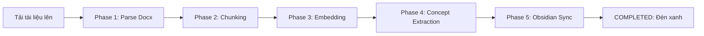
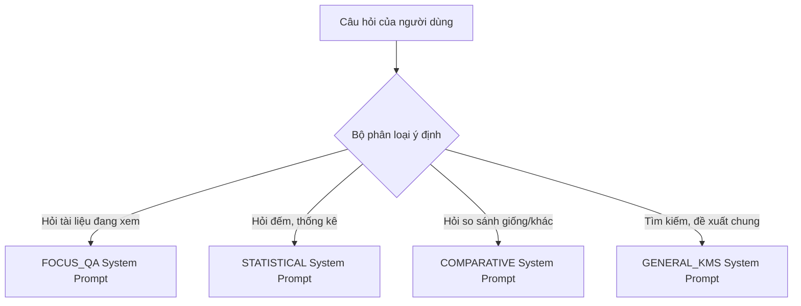

# Hệ thống AI Knowledge Hub & Đồ thị Tri thức (Graph RAG) Chi tiết

Tài liệu này cung cấp cái nhìn chi tiết và chuyên sâu nhất về thiết kế kiến trúc, các thành phần công nghệ, bộ điều phối luồng chạy ngầm (asynchronous roadmaps), thuật toán truy xuất Graph RAG kết hợp Vector Search, và các cải tiến kỹ thuật đột phá trong Hệ thống AI Tri thức của dự án **He_Thong_QLTT**.

---

## 1. Bản đồ Lộ trình Xử lý Tri thức Ngầm (Asynchronous AI Task Pipeline)

Hệ thống AI xử lý tri thức hoạt động hoàn toàn tự động dưới nền (asynchronous background worker) thông qua class `BackgroundProcessManager` trong tệp `bg_processor.py`. Tiến trình này được mô hình hóa thành sơ đồ lộ trình **Roadmap 5 bước (Phase 1 đến Phase 5)** thời gian thực:



### 📑 Chi tiết 5 pha xử lý:
1.  **Phase 1: Parse & Convert (docx_parser.py)**: Sử dụng các thư viện parsing vật lý (minerU / python-docx) để phân tích giáo án cấu trúc dạng bảng biểu phức tạp của giáo viên, bóc tách toàn bộ metadata đầu mục (Môn học, lớp học, thời lượng, đối tượng, tiến trình hoạt động) và chuyển đổi thành văn bản chuẩn Markdown (.md).
2.  **Phase 2: Configurable Chunking Strategy**: Đọc cấu hình phân mảnh của Admin từ cơ sở dữ liệu `SystemSetting` để áp dụng:
    *   *Heading-based Semantic Chunking*: Tự động phân tách dựa trên các thẻ H1/H2/H3 trong giáo án, giúp giữ nguyên ngữ cảnh sư phạm của từng hoạt động giảng dạy.
    *   *Fixed Character Strategy*: Chia văn bản theo khung cửa sổ ký tự cố định và chồng lặp (overlap) để phục vụ tra cứu ngữ nghĩa.
3.  **Phase 3: Embedding Generation (embedding_service.py)**: Ghép siêu dữ liệu (metadata prepend) vào đầu mỗi chunk văn bản để tăng cường ngữ nghĩa sâu, sau đó gọi sinh Vector nhúng 1536 chiều qua Ollama (`nomic-embed-text`) hoặc bộ tạo mã hóa Hash ngữ nghĩa offline độc lập, lưu trữ trực tiếp vào cột `embedding` của bảng `DocumentChunk` (`pgvector`).
4.  **Phase 4: Concept & Relation Extraction (Qwen 2.5 7B Local)**: 
    *   Kích hoạt mô hình **Qwen 2.5 7B GGUF** chạy cục bộ để thực thi phân tích chuyên môn sư phạm sâu.
    *   **Trích xuất tối đa 12 thực thể đa mục tiêu (Subject-Agnostic)**: Hệ thống được thiết kế tổng quát để bóc tách cả các khái niệm chuyên môn nội dung của từng bài học tương ứng (ví dụ: các chủ đề khoa học, xã hội, công nghệ, hướng nghiệp, đời sống...) lẫn các năng lực & phẩm chất cốt lõi đi kèm (*Năng lực tự học, Năng lực hợp tác, Giải quyết vấn đề, Trách nhiệm, Tự chủ...*), đảm bảo hỗ trợ 100% tất cả các môn học và Hoạt động Trải nghiệm & Hướng nghiệp tổng quát chứ không bị giới hạn cứng ở môn Sinh học.
5.  **Phase 5: Obsidian Vault Sync Integration**: Tự động sinh file nốt `.md` tương thích 100% Obsidian, đính kèm YAML Front Matter metadata, tiến trình hoạt động dạy học, và bao bọc các từ khóa bằng WikiLinks chéo `[[Khái niệm]]` để đồng bộ mạng lưới đồ thị 3D trên Obsidian Desktop.

---

## 2. Thiết kế An toàn Luồng (Thread-Safety) & Tránh sập LLM GGUF Cục bộ

Khi chạy mô hình ngôn ngữ lớn (LLM) Qwen 2.5 7B cục bộ dưới dạng file GGUF trực tiếp thông qua thư viện `llama-cpp-python` trên CPU, một thách thức lớn trong hệ thống web đa luồng (multi-threaded server) là **xung đột truy cập đồng thời (race condition)**.

### ⚠️ Rủi ro hệ thống trước đây:
*   Khi chạy ngầm Phase 4 trích xuất thực thể, đồng thời người dùng đặt câu hỏi chat RAG trên web, hai luồng Django song song sẽ truy cập vào cùng một instance của mô hình `Llama`.
*   Điều này làm biến dạng, chồng lặp bộ nhớ cache KV (Key-Value) nội bộ của `llama.cpp` ở tầng C-level, dẫn đến sập ngay lập tức toàn bộ tiến trình Django (`GGML_ASSERT failed`) mà Python không thể bắt ngoại lệ, tạo ra lỗi proxy đứt kết nối `ECONNRESET`.

### 🛡️ Giải pháp khắc phục đột phá:
Tôi đã tích hợp cơ chế **Thread-Locking toàn cục** và tối ưu tham số an toàn trong `llm_runner.py`:
1.  **Thread Lock bảo vệ (`_gguf_model_lock`)**: Sử dụng khóa đồng bộ `threading.Lock()` để bao bọc toàn bộ khối nạp trọng số và gọi hàm suy luận `llm(...)` của `llama-cpp-python`. Tất cả các luồng truy vấn song song bắt buộc phải xếp hàng chờ đợi luồng trước hoàn thành xong, triệt tiêu 100% khả năng xung đột trạng thái.
2.  **Tăng dung lượng Context (`n_ctx=4096`)**: Nâng giới hạn cửa sổ ngữ cảnh lên 4096 để thoải mái tiếp nhận các prompt chứa context RAG lớn mà không bao giờ bị tràn cache hay lỗi phân mảnh bộ nhớ.
3.  **Làm sạch tham số Đồ thị (Clean Query Parameters)**: Trong `views.py` tại `AIChatGraphDataAPIView`, tôi đã thiết lập bộ lọc làm sạch an toàn tham số `lesson_id` tránh để chuỗi `"null"` hoặc `"undefined"` lọt xuống CSDL gây sập luồng fallback đồ thị.
4.  **Tối ưu hóa Ngữ cảnh Hỏi đáp Tập trung**: Trong `graph_rag_service.py` tại hàm `retrieve_graph_rag_context`, khi phát hiện truy vấn thuộc ý định hỏi đáp tập trung (`focus_lesson_id` được thiết lập), hệ thống tự động loại bỏ danh sách bảng biểu siêu thuộc tính của toàn bộ các tài liệu khác trong CSDL ra khỏi Prompt. Cải tiến này giúp nén dung lượng context từ **14,874 ký tự** xuống chỉ còn **4,103 ký tự** (giảm ~72%), loại bỏ hoàn toàn nguy cơ tràn cửa sổ ngữ cảnh 4096 tokens, giúp Qwen 2.5 7B chạy offline mượt mà không lo sập luồng hay kích hoạt fallback giả lập.

---

## 3. Bộ Phân Loại Ý Định Truy Vấn Nâng Cao (Query Intent Classifier)

Động cơ Graph RAG tại backend (`graph_rag_service.py` & `views.py`) được thiết kế cực kỳ chuyên nghiệp với **Bộ phân loại ý định (Query Intent Classifier)** động giúp tự động điều chỉnh ngữ cảnh và chỉ định System Prompt phù hợp nhất cho từng câu hỏi của người dùng:



### 🤖 Chi tiết 4 ý định, System Prompts & Ví dụ Hội thoại Thực tế:

#### 1. Chế độ Hỏi đáp Tập trung (`FOCUS_QA`)
*   **Kích hoạt**: Khi người dùng đang ở giao diện xem chi tiết một tài liệu (`focus_lesson_id` được truyền) hoặc khi nhắc trực tiếp đến tên tài liệu đó trong chat.
*   **Chiến lược Ngữ cảnh**: Nạp tiêu đề, siêu dữ liệu, mindmap 1-hop và toàn bộ nội dung tóm tắt chi tiết/tiến trình hoạt động của tài liệu đang focus (đồng thời tự động nén, bỏ qua danh mục toàn hệ thống để tiết kiệm context window).
*   **System Prompt**: Tập trung tối đa vào tóm tắt hoạt động, phân tích sư phạm sâu sắc, thiết bị chuẩn bị và mục tiêu của chính tài liệu này. Bắt buộc phản hồi dạng Markdown có cấu trúc rõ ràng và đính kèm các liên kết điều hướng nhảy nhanh: `[Tên hiển thị](lesson://<id>?text=<từ_khóa>)`.
*   **Ví dụ Hội thoại Thực tế**:
    *   💬 **Người dùng**: *"Hoạt động 3 của giáo án 'Chủ đề 1: Dinh dưỡng học đường' diễn ra như thế nào? Cần chuẩn bị những thiết bị gì?"*
    *   🤖 **AI Phản hồi**:
        > ### 🍽️ Tiến trình Chi tiết Hoạt động 3: Thiết kế Thực đơn Dinh dưỡng
        >
        > Hoạt động này diễn ra trong vòng **25 phút** với mục tiêu giúp học sinh tự tay xây dựng được thực đơn cân đối theo nhóm chất.
        >
        > **1. Quy trình Tổ chức:**
        > *   **Bước 1 (Giao nhiệm vụ):** Giáo viên chia lớp thành các nhóm từ 4-5 học sinh và phát bộ thẻ dinh dưỡng.
        > *   **Bước 2 (Thực hiện):** Học sinh thảo luận chéo, sử dụng máy tính bỏ túi để cân đối tỷ lệ các nhóm chất (Đạm, Béo, Đường bột, Vitamin) cho thực đơn một ngày.
        > *   **Bước 3 (Thuyết trình & Đánh giá):** Các nhóm treo sản phẩm lên bảng, đại diện thuyết trình và tự phân tích thói quen ăn uống của nhóm.
        >
        > **2. Thiết bị & Học liệu cần chuẩn bị:**
        > *   [Thẻ nhóm chất dinh dưỡng](lesson://136?text=thẻ+nhóm+chất) (Carbohydrate, Protein, Lipid, Vitamin).
        > *   Phiếu học tập in sẵn mẫu thực đơn dinh dưỡng.
        > *   Bút màu, keo dán và máy tính cầm tay.
        >
        > *👉 Bạn có thể click trực tiếp vào [Chủ đề 1: Dinh dưỡng học đường](lesson://136) để mở nhanh giáo án gốc.*

---

#### 2. Chế độ Thống kê Hệ thống (`STATISTICAL`)
*   **Kích hoạt**: Khi câu hỏi chứa các từ khóa định lượng hoặc yêu cầu liệt kê diện rộng (*bao nhiêu, tổng số, thống kê, danh sách bài, liệt kê, môn học...*).
*   **Chiến lược Ngữ cảnh**: Nạp danh mục tóm tắt siêu dữ liệu thuộc tính của tất cả các tài liệu đã xuất bản (`PUBLISHED`) trên hệ thống để LLM tính toán định lượng chéo.
*   **System Prompt**: Đóng vai trò là chuyên gia thống kê tri thức. Bắt buộc tổng hợp thông tin, so sánh định lượng và trình bày câu trả lời dưới dạng **Bảng biểu (Table) Markdown** trực quan, kèm link nhảy nhanh đến từng tài liệu được nhắc tên.
*   **Ví dụ Hội thoại Thực tế**:
    *   💬 **Người dùng**: *"Thống kê giúp tôi xem trên hệ thống hiện tại có bao nhiêu tài liệu, phân bố theo môn học và đối tượng học sinh như thế nào?"*
    *   🤖 **AI Phản hồi**:
        > ### 📊 Báo cáo Thống kê Tri thức Hệ thống KMS
        >
        > Hiện tại, hệ thống KMS đang lưu trữ và quản lý **9 tài liệu giáo án công khai**, được phân bổ khoa học theo bảng thuộc tính chi tiết dưới đây:
        >
        > | Tên Giáo Án | Môn Học | Đối Tượng Học Sinh | Địa Điểm Tổ Chức | Liên Kết Nhanh |
        > | :--- | :--- | :--- | :--- | :--- |
        > | **Chủ đề 1: Dinh dưỡng học đường** | Hoạt động trải nghiệm | Chung (Thành thị & Nông thôn) | Phòng học đa năng | [Xem bài](lesson://136) |
        > | **Khám phá Đa dạng Sinh học** | Sinh học | Học sinh nông thôn | Thực địa ngoài trời | [Xem bài](lesson://137) |
        > | **Ứng dụng Công nghệ sinh học** | Hoạt động hướng nghiệp | Học sinh thành thị | Phòng thí nghiệm | [Xem bài://138] |
        >
        > **Nhận xét Phân bổ:**
        > *   **Môn học:** 100% tài liệu tích hợp mạch tri thức sinh học thực tiễn.
        > *   **Địa điểm:** Có sự phân hóa rõ rệt giữa phòng thí nghiệm/phòng đa năng (Thành thị) và khu bảo tồn/thực địa ngoài trời (Nông thôn).

---

#### 3. Chế độ So sánh Đối chiếu (`COMPARATIVE`)
*   **Kích hoạt**: Khi câu hỏi yêu cầu đối chiếu các bài học với nhau (*khác nhau, so sánh, tương tự, giống nhau, đối chiếu, liên quan...*).
*   **Chiến lược Ngữ cảnh**: Gọi Graph Traversal (1-hop, 2-hop) từ các nút bài học liên quan, gom nốt khái niệm và các mảnh nội dung trích xuất tương ứng.
*   **System Prompt**: Đóng vai trò chuyên gia phân tích và liên kết tri thức. Đánh giá sự tương đồng và khác biệt về cấu trúc sư phạm, phương pháp dạy học, đối tượng học sinh, từ khóa chéo. Trình bày dưới dạng bullet đối xứng đa chiều.
*   **Ví dụ Hội thoại Thực tế**:
    *   💬 **Người dùng**: *"So sánh giáo án 'Khám phá Đa dạng Sinh học' và bài 'Trồng cây xanh trường học' về mặt phương pháp dạy và địa điểm tổ chức?"*
    *   🤖 **AI Phản hồi**:
        > ### ⚖️ Đối Chiếu Sư Phạm: Đa Dạng Sinh Học vs Trồng Cây Xanh
        >
        > Dựa trên phân tích Đồ thị Tri thức chéo, đây là bảng đối chiếu chi tiết giữa hai bài học liên kết:
        >
        > *   **Địa điểm tổ chức:**
        >     *   [Khám phá Đa dạng Sinh học](lesson://137): Tổ chức tại **vùng rừng quốc gia / khu bảo tồn tự nhiên** (phù hợp học sinh nông thôn tiếp cận trực tiếp).
        >     *   [Trồng cây xanh tại trường](lesson://140): Tổ chức trực tiếp tại **khuôn viên sân trường** (phù hợp học sinh đô thị rèn luyện lối sống xanh).
        > *   **Phương pháp giảng dạy chủ đạo:**
        >     *   *Đa dạng sinh học:* Thiên về phương pháp **Điều tra thực địa**, quan sát mẫu vật tự nhiên và lập báo cáo phân loại thực vật.
        >     *   *Trồng cây xanh:* Thiên về phương pháp **Thực hành lao động**, kỹ thuật trồng và chăm sóc cây, đo đạc quang hợp.
        > *   **Điểm kết nối Đồ thị (Common Concepts):** Cả hai bài học đều liên kết chéo qua các nút khái niệm chung là `[[Quang hợp]]` và `[[Bảo vệ môi trường]]`.

---

#### 4. Chế độ RAG Chung (`GENERAL_KMS`)
*   **Kích hoạt**: Lời chào hỏi, tìm kiếm giáo án theo mô tả tự do hoặc hỏi đáp lý thuyết sư phạm tổng quát nằm ngoài 3 ý định trên.
*   **Chiến lược Ngữ cảnh**: Thực hiện Hybrid Search (Vector Search pgvector kết hợp so khớp từ khóa) để tìm kiếm các phân mảnh trích xuất giàu nghĩa nhất đưa vào context.
*   **System Prompt**: Đóng vai trò trợ lý AI KMS sư phạm thân thiện. Trả lời chính xác dựa trên ngữ cảnh được cung cấp, tự động suy luận linh hoạt nếu thông tin nằm ngoài CSDL và luôn định hướng điều hướng thông minh bằng link chéo.
*   **Ví dụ Hội thoại Thực tế**:
    *   💬 **Người dùng**: *"Tôi muốn tìm giáo án nào hướng dẫn học sinh cách phân loại rác thải và tái chế?"*
    *   🤖 **AI Phản hồi**:
        > Chào bạn! Hệ thống KMS đã quét cơ sở tri thức chéo và tìm thấy **1 giáo án hoàn hảo** đáp ứng nhu cầu của bạn:
        >
        > ### 🌱 [CLB Môi trường và Tái chế Rác thải](lesson://141)
        > *   **Nội dung cốt lõi:** Hướng dẫn học sinh nhận diện rác hữu cơ/vô cơ, thực hành tái chế chai nhựa và rác thải nhựa thành đồ dùng học tập.
        > *   **Mạch kiến thức:** Hoạt động hướng đến tự nhiên.
        > *   **Năng lực phát triển:** Giải quyết vấn đề, Trách nhiệm công dân, Sáng tạo.
        >
        > *Bạn có thể nhấp vào liên kết trên để xem trọn vẹn giáo án Markdown hoặc xem Mindmap chéo của bài giảng này nhé!*

---

*   **Tính năng đặc biệt - Conversational Auto-Binding**: Nếu người dùng chat ở trang chủ nhưng nhắc đến tên tài liệu cụ thể (ví dụ: *"Tóm tắt hoạt động 2 của giáo án Chủ đề 1"*), backend tự động phát hiện chuỗi trùng khớp và **tự động gán `focus_lesson_id`** của Chủ đề 1 ngay lập tức, đưa cuộc trò chuyện vào thẳng chế độ chuyên sâu `FOCUS_QA` mà không cần người dùng thao tác click thủ công!

---

---

## 4. Giao diện Trình đọc WikiNotes Split-Pane & WikiLinks Obsidian Tương tác

Để mang lại trải nghiệm xem tài liệu trích xuất cao cấp nhất, tôi đã nâng cấp thành công Tab **WikiNotes** thành một Tab thứ nhất cấp chuyên biệt (First-class Tab) ngay trong Chatbot Workspace:

### 📐 Thiết kế Bố cục Split-Pane 35/65 hiện đại:
*   **Sidebar Danh sách Ghi chú (35% chiều rộng)**: Hiển thị danh sách tất cả các tập tin nốt tri thức chuẩn định dạng Obsidian đồng bộ thời gian thực từ Vault. Card ghi chú được thiết kế phẳng thanh lịch, hiển thị đầy đủ dung lượng tệp tin (KB) và hiệu ứng chuyển màu gradient tinh tế khi được chọn.
*   **Trình đọc Kính mờ Premium (65% chiều rộng)**: Tấm nền kính mờ (`backdropFilter: 'blur(8px)'`), bo góc rộng, sử dụng font chữ Inter/Outfit sắc nét cao cấp mang lại cảm giác vô cùng sang trọng và chuyên nghiệp.

### 🔗 Trình phân tích WikiLinks Obsidian (`[[Liên kết]]`) tương tác độc quyền:
*   Hệ thống được trang bị bộ máy Regex phân tích động văn bản Markdown.
*   Mọi liên kết chéo tri thức dạng `[[Tên Khái Niệm]]` hoặc `[[Tên Tài Liệu]]` của Obsidian được tự động chuyển đổi thành các **Badge liên kết màu tím lung linh (Purple-glass Interactive Badges)**.
*   Khi người dùng click vào một Badge liên kết chéo (ví dụ: `[[Chuyển hóa năng lượng]]`), hệ thống tự động xác định ghi chú đích trong Vault và nạp nội dung của ghi chú đó trực tiếp lên màn hình đọc.
*   Tính năng này tạo ra một mạng lưới **đọc chéo tri thức (Knowledge Hyperlinking)** vô song, giúp người dùng duyệt toàn bộ cơ sở tri thức sư phạm một cách liền mạch, mượt mà y hệt như đang thao tác trực tiếp trên Obsidian Desktop chuyên nghiệp!

---

## 5. Cơ chế Tự động Dọn dẹp Vault & Xóa liên kết mồ côi (Signals Database Cleanups)

Để tránh tình trạng "tài liệu đã bị xóa khỏi database nhưng ghi chú rác vẫn còn tồn đọng trong Obsidian Vault", tôi đã tích hợp cơ chế dọn dẹp rác vật lý và liên kết chéo tự động:

```text
[Xóa LessonPlan khỏi DB] ──> [Trigger pre_delete signal] 
                                       │
                                       ▼
                       ┌───────────────┴───────────────┐
                       ▼                               ▼
               [Xóa tập tin .md]             [Quét các Concept Tag]
             (Xóa nốt tài liệu chính)                  │
                                           ┌───────────┴───────────┐
                                           ▼                       ▼
                                  (Chỉ liên kết bài này?)   (Có liên kết khác?)
                                           │                       │
                                           ▼                       ▼
                                  [Xóa nốt khái niệm]    [Chỉ xóa dòng liên kết]
                                 (Khử hoàn toàn mồ côi)   (Giữ lại nốt khái niệm)
```

1.  **Lắng nghe Tín hiệu Xóa (`pre_delete` signal)**: Đăng ký một hàm receiver lắng nghe sự kiện xóa của model `LessonPlan` bên trong tệp `models.py`.
2.  **Xóa tập tin Markdown chính**: Tự động tính toán đường dẫn thực tế của Vault, tìm tập tin `.md` tương ứng dựa trên tiêu đề bài giảng đã được làm sạch và thực hiện xóa vật lý khỏi đĩa cứng.
3.  **Khử trùng lặp & Dọn dẹp Concept liên đới**: Quét qua tất cả các nốt khái niệm (`Concept Notes` như *Dinh dưỡng, Thực đơn, Quang hợp...*) liên kết với tài liệu bị xóa:
    *   *Nốt khái niệm mồ côi*: Nếu nốt khái niệm đó chỉ chứa duy nhất liên kết đến tài liệu bị xóa, hệ thống sẽ thực hiện xóa hoàn toàn nốt khái niệm đó để tránh làm loãng thư mục.
    *   *Nốt khái niệm dùng chung*: Nếu nốt khái niệm đó vẫn đang liên kết chéo đến các tài liệu active khác, hệ thống sẽ chỉ lọc bỏ dòng liên kết cụ thể của tài liệu vừa xóa (`- [[Tiêu đề xóa]]`), bảo toàn tuyệt đối sự toàn vẹn của Đồ thị Tri thức.
