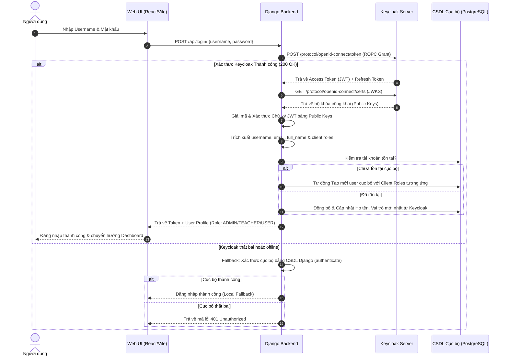

# Tích hợp Keycloak IAM & Đồng bộ Cơ sở Dữ liệu Hai chiều (SSO & Sync Documentation)

Tài liệu này chi tiết cấu trúc kiến trúc, các luồng nghiệp vụ và cấu hình kỹ thuật để tích hợp hệ thống quản lý danh tính **Keycloak (Identity and Access Management - IAM)** với **Hệ thống KMS**. Hệ thống hỗ trợ xác thực trực tiếp trên giao diện web và đồng bộ hai chiều (Bidirectional Sync) thời gian thực giữa cơ sở dữ liệu (CSDL) cục bộ của web và Keycloak.

---

## 🗺️ 1. Sơ đồ Cấu trúc & Luồng Xác thực

### 1.1. Luồng Đăng nhập Trực tiếp trên Web (OAuth2 Resource Owner Password Credentials - ROPC)
Người dùng điền tài khoản và mật khẩu trực tiếp trên giao diện Web KMS mà không cần chuyển hướng sang trang quản trị của Keycloak:



---

## 🔄 2. Cơ chế Đồng bộ Hai chiều (Bidirectional Sync)

### 2.1. Đồng bộ từ Web sang Keycloak (Web ➔ Keycloak)
Khi quản trị viên hoặc người dùng thực hiện các thao tác quản trị trên giao diện Web, hệ thống tự động gọi API của Keycloak để cập nhật tương ứng:

*   **Đăng ký tài khoản (Register)**: Khi người dùng đăng ký mới trên Web, `RegisterAPIView` gọi `create_keycloak_user` để tạo tài khoản trên Keycloak rồi lưu vào CSDL cục bộ.
*   **Thêm người dùng mới bởi Admin (Create User)**: Khi Admin thêm mới người dùng trong trang quản trị, hệ thống gọi `create_keycloak_user`.
*   **Sửa thông tin người dùng bởi Admin (Edit User)**: Khi Admin chỉnh sửa Username, Họ tên, Trạng thái Kích hoạt/Khóa tài khoản trên web, hệ thống gọi `update_keycloak_user_details` để đồng bộ sang Keycloak.
*   **Admin đặt lại mật khẩu (Reset Password)**: Khi Admin cập nhật mật khẩu mới cho người dùng trên web, hệ thống gọi `update_keycloak_password`.
*   **Người dùng thay đổi thông tin (Profile Update)**: Khi người dùng đổi Họ tên hoặc Mật khẩu trong trang cá nhân, hệ thống tự động đồng bộ thay đổi sang Keycloak.
*   **Xóa người dùng (Delete User)**: Khi Admin xóa tài khoản trên web, hệ thống gọi `delete_keycloak_user` để xóa tài khoản trên Keycloak.

### 2.2. Đồng bộ từ Keycloak về Web (Keycloak ➔ Web)
Để cập nhật các thay đổi thực hiện trực tiếp trên Trang quản trị Keycloak (ví dụ: tạo, sửa, xóa tài khoản thủ công trên Keycloak Console):

*   **Thời điểm kích hoạt**: Khi Admin truy cập trang **Quản lý tài khoản (UserManagementPage)** trên Web, hệ thống tự động gửi yêu cầu lấy danh sách người dùng.
*   **Luồng xử lý ngầm (`sync_keycloak_to_local_db`)**:
    1.  Backend gửi yêu cầu `GET /admin/realms/{realm}/users` lấy toàn bộ người dùng từ Keycloak (tối đa 1000 users).
    2.  Hệ thống so sánh danh sách Keycloak và CSDL cục bộ:
        *   **Thêm mới**: Người dùng tồn tại trên Keycloak nhưng chưa có ở Web ➔ Tự động tạo tài khoản cục bộ tương ứng (role mặc định: `USER`).
        *   **Cập nhật**: Người dùng có trên cả hai hệ thống nhưng khác biệt về Họ tên, Email, Trạng thái Kích hoạt (Enabled/Disabled) ➔ Cập nhật thông tin cục bộ theo thông tin mới nhất của Keycloak.
        *   **Xóa bỏ**: Người dùng không còn tồn tại trên Keycloak nhưng vẫn có trên Web ➔ Tự động xóa khỏi CSDL cục bộ (ngoại trừ tài khoản `admin` hệ thống).

---

## ⚙️ 3. Cấu hình Kỹ thuật (.env)

Các biến cấu hình bắt buộc phải khai báo trong file [backend/.env](file:///d:/He_Thong_QLTT/backend/.env) để hệ thống hoạt động chính xác:

```env
# Kích hoạt Keycloak (True: Bật, False: Chạy local)
USE_KEYCLOAK=True

# Đường dẫn API Realm của dự án
KEYCLOAK_SERVER_URL=http://localhost:8080/realms/kms_realm

# Client ID cấu hình trên Keycloak
KEYCLOAK_CLIENT_ID=kms-web-client

# Cấu hình tài khoản Quản trị viên Master (dùng để gọi Admin REST API)
# Tên đăng nhập và Mật khẩu tài khoản admin Master của Keycloak
KEYCLOAK_ADMIN_USER=admin
KEYCLOAK_ADMIN_PASSWORD=admin
```

---

## 🛠️ 4. Chi tiết các File và Hàm Core xử lý

### 4.1. Backend Helpers ([backend/app/views.py](file:///d:/He_Thong_QLTT/backend/app/views.py))

*   **`get_keycloak_admin_token()`**: Lấy Access Token của admin để gọi các API quản trị của Keycloak (dùng Client ID `admin-cli` của master realm).
*   **`create_keycloak_user(username, email, full_name, password)`**: Gọi API Keycloak tạo mới tài khoản (trạng thái hoạt động mặc định: `enabled: True`, mật khẩu vĩnh viễn: `temporary: False`).
*   **`update_keycloak_user_details(old_username, new_username, email, full_name, is_active)`**: Cập nhật thông tin chi tiết của user trên Keycloak (Username, Họ tên, trạng thái kích hoạt).
*   **`update_keycloak_password(username, new_password)`**: Đặt lại mật khẩu mới cho user trên Keycloak.
*   **`delete_keycloak_user(username)`**: Xóa tài khoản người dùng trên Keycloak.
*   **`sync_keycloak_to_local_db()`**: Thực hiện kéo dữ liệu từ Keycloak về và đồng bộ chéo CSDL PostgreSQL cục bộ.

### 4.2. Giao diện Web ([protoc/src/app/App.tsx](file:///d:/He_Thong_QLTT/protoc/src/app/App.tsx))

*   **Trường ẩn/hiện mật khẩu**: Tích hợp các nút Show/Hide mật khẩu (bật tắt `type="password" / type="text"`) ở form Đăng nhập, Đăng ký, Đổi mật khẩu qua OTP, và Cài đặt hồ sơ cá nhân.
*   **Tự động điền sau khi quên mật khẩu**:
    *   Sau khi nhận mã OTP gửi qua Email và đổi mật khẩu thành công.
    *   Web tự động điền tài khoản, tự động điền mật khẩu mới và kích hoạt hiển thị mật khẩu (`showPassword = true`) ở form Đăng nhập để người dùng tiện kiểm tra và ấn nút Đăng nhập lập tức.
