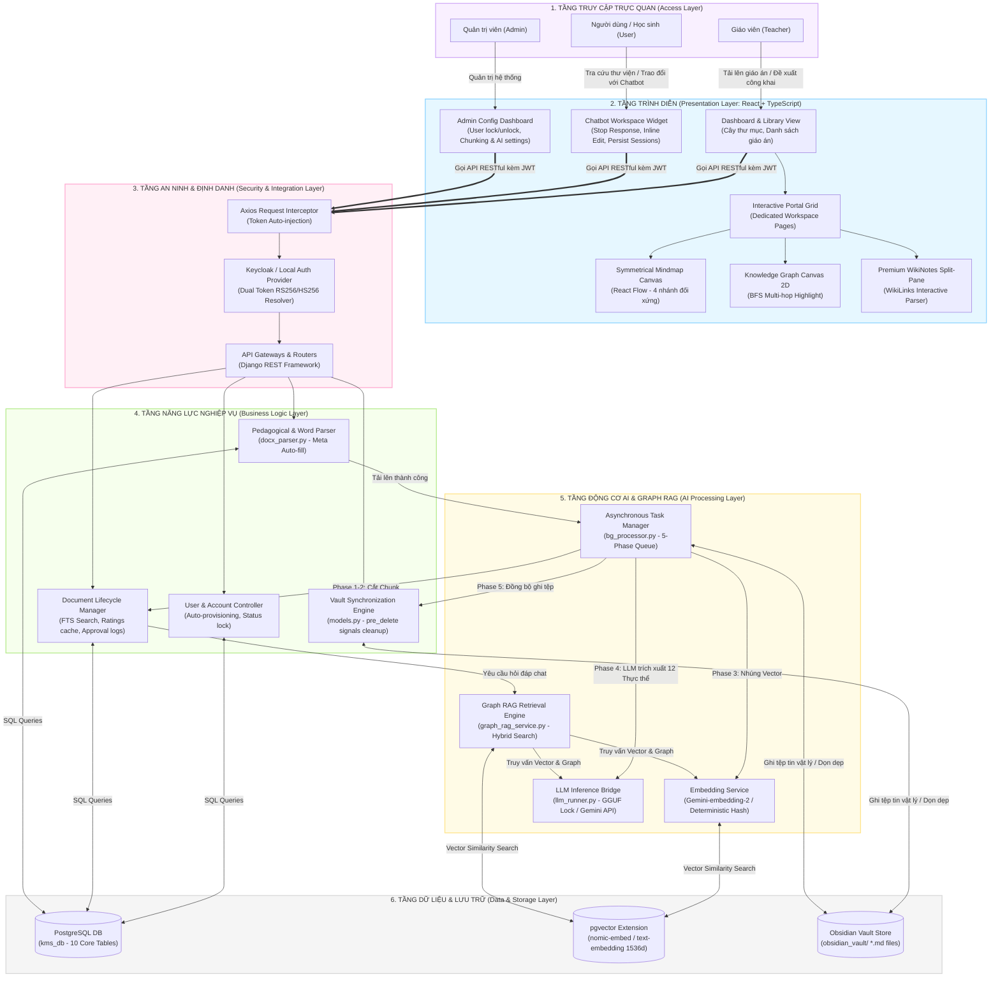

# Kiến trúc Hệ thống Quản lý Tri thức (KMS) - Sơ đồ Module & Kiến trúc dạng ERP

Tài liệu này hệ thống hóa toàn bộ các module chức năng đã xây dựng trong hệ thống **KMS (Knowledge Management System / He_Thong_QLTT)**, đồng thời mô tả kiến trúc tổng thể dưới dạng sơ đồ đa tầng tương tự như kiến trúc hệ thống hoạch định tài nguyên doanh nghiệp (ERP System Architecture).

---

## 1. Danh sách các Module Nghiệp vụ trong Hệ thống

Hệ thống KMS được chia thành **5 khối module chính** hoạt động đồng bộ với nhau, phân tách rõ ràng giữa giao diện người dùng (Presentation), nghiệp vụ hệ thống (Business Logic), động cơ trí tuệ nhân tạo (AI Engine) và lưu trữ dữ liệu (Storage).

```
   ┌─────────────────────────────────────────────────────────────┐
   │                    HỆ THỐNG KMS (KNOWLEDGE HUB)            │
   └──────────────────────────────┬──────────────────────────────┘
         ┌────────────────────────┼────────────────────────┐
         ▼                        ▼                        ▼
┌─────────────────┐      ┌─────────────────┐      ┌─────────────────┐
│  MODULE QUẢN LÝ │      │   MODULE RAG &  │      │MODULE ĐỒNG BỘ   │
│   THƯ VIỆN &    │      │  TRUY VẤN AI    │      │ OBSIDIAN VAULT  │
│    NGHIỆP VỤ    │      │  TRÍ TUỆ NHÂN   │      │ (KNOWLEDGE SYNC)│
│ (Core Library)  │      │   TẠO (RAG)     │      └─────────────────┘
└─────────────────┘      └─────────────────┘               │
         ▲                        ▲                        ▼
         │                        │               ┌─────────────────┐
         │                        │               │ MODULE QUẢN TRỊ │
         └────────────────────────┴───────────────│    HỆ THỐNG &   │
                                                  │ XÁC THỰC (ADMIN)│
                                                  └─────────────────┘
```

### 1.1. Module Quản lý Thư viện & Nghiệp vụ Giáo án (Core Library & Workflow Module)
Đây là module quản lý vòng đời tài liệu học tập, giáo án và tương tác giữa các giảng viên:
*   **Quản lý cây thư mục đệ quy (Directory Tree Manager):** Phân cấp thư mục cá nhân và thư mục công khai, hỗ trợ thao tác nhanh trực tiếp trên UI (tạo thư mục con, đổi tên inline, thay đổi trạng thái Công khai/Riêng tư, xóa đệ quy).
*   **Quản lý tài liệu giáo án (Lesson Plan Repository):** Tải lên và hiển thị giáo án dưới dạng Word (.docx), Markdown (.md) hoặc Text (.txt). Hỗ trợ tải xuống bản Word gốc hoặc bản sao Markdown đồng bộ.
*   **Quy trình Phê duyệt Giáo án (Approval Workflow):** Cho phép giáo viên đề xuất công khai tài liệu, ban quản trị (Admin) kiểm duyệt trực quan nội dung kèm tệp Word nhúng trực tiếp trong trình duyệt trước khi phê duyệt.
*   **Bình luận & Đánh giá (Feedback & Rating Engine):** Hệ thống đánh giá số sao (kèm biểu đồ thanh phân bổ sao và bộ lọc tương tác), viết và sửa bình luận inline, lưu trữ cache đánh giá cấp phiên (Session-level) để tăng tốc tải trang.
*   **Tìm kiếm Đa nhiệm (Unified Search & Filters):** Tìm kiếm thông minh FTS (Full-Text Search) kết hợp Vector Search và bộ lọc đa tiêu chí (môn học, lớp học, đối tượng học sinh, từ khóa...).

### 1.2. Module Trích xuất Tri thức & Phân tích Sư phạm (Pedagogical Parser Module)
Module chịu trách nhiệm tự động hóa việc đọc hiểu cấu trúc giáo án:
*   **Bộ phân tích Word sang Markdown (Docx to Markdown Parser):** Tự động bóc tách metadata (tiêu đề, môn học, lớp, thời lượng, đối tượng, từ khóa) và cấu trúc hóa nội dung tài liệu.
*   **Bộ phân tích Sư phạm Thích ứng (Adaptive Pedagogical Parser):** Nhận diện cấu trúc giáo án dạng bảng hoặc văn bản tự do, trích xuất mục tiêu dạy học (kiến thức, năng lực, phẩm chất) và thiết bị dạy học.
*   **Trình vẽ Sơ đồ Tư duy 4 nhánh (Symmetrical Mindmap Generator):** Tự động chuyển đổi nội dung giáo án thành sơ đồ tư duy trực quan đối xứng hai bên (Bilateral Symmetrical Layout) với 4 nhánh chính: *Mục tiêu dạy học, Thiết bị dạy học, Tiến trình dạy học, Hoạt động chi tiết*. Hỗ trợ các nút thu phóng, reset và "🎯 Về giữa" mượt mà (React Flow fitView).

### 1.3. Module Động cơ AI & Graph RAG (AI & Graph RAG Engine Module)
Trọng tâm xử lý trí tuệ nhân tạo nâng cao của hệ thống:
*   **Bộ xử lý tác vụ ngầm tuần tự (Asynchronous Task Manager):** Xử lý quy trình 5 bước ngầm khi tải giáo án (Parse -> Chunking -> Embedding -> Concept Extraction -> Obsidian Sync). Hỗ trợ dừng khẩn cấp tác vụ (Stop Task/Cancellation) và giải phóng bộ nhớ khi đóng trình duyệt (Beacon API).
*   **Cổng suy luận mô hình ngôn ngữ (LLM Inference Controller):** Tích hợp chạy mô hình Qwen Local (3B/7B GGUF) thông qua `llama-cpp-python` (có khóa đồng bộ luồng `_gguf_model_lock` và context window 4096 tokens để tránh crash) song song với việc gọi các API thương mại (Gemini / OpenAI).
*   **Dịch vụ Nhúng Vector (Embedding Service):** Hỗ trợ sinh vector 1536 chiều bằng Ollama, Gemini API (`gemini-embedding-2`), hoặc bộ tạo hàm băm đặc trưng offline (Deterministic Hashing) khi không có mạng.
*   **Công cụ Tìm kiếm Lai (Graph RAG Hybrid Engine):** Kết hợp Vector tương đồng (`pgvector`), Tìm kiếm từ khóa (FTS) và Duyệt đồ thị (Graph Traversal) để trích xuất ngữ cảnh RAG tối ưu, tự động bind ngữ cảnh tài liệu đang xem.

### 1.4. Module Bản đồ Tri thức & Đồ thị tương tác (Knowledge Graph Canvas Module)
Module hiển thị trực quan hóa mạng lưới tri thức trên client:
*   **Interactive Knowledge Graph Canvas:** Vẽ đồ thị 2D Force-Directed trên thẻ HTML5 Canvas hiệu năng cao, hỗ trợ Zoom & Pan, và khóa sự kiện wheel để tránh lỗi cuộn trang web chính (Overscroll Chaining).
*   **Hiển thị độ sâu liên kết (Multi-hop BFS Edge Highlight):** Thuật toán BFS tìm kiếm các liên kết thực thể từ 1 đến 4 cạnh (Hops) và tô màu gradient tương ứng với khoảng cách (Hop 0: Xanh dương, Hop 1: Cyan, Hop 2: Xanh lá, Hop 3: Vàng, Hop 4: Cam).
*   **Bộ lọc danh mục đồ thị (Legend Filters):** Thanh chú giải cho phép người dùng click để ẩn/hiện động các loại node thực thể (Bài giảng, Thư mục, Từ khóa, Người dùng) trực tiếp trên đồ thị.

### 1.5. Module Đồng bộ Obsidian Vault (Obsidian Integration Module)
Module đồng bộ và chuyển đổi tri thức sang môi trường quản trị ghi chú cá nhân:
*   **Obsidian Vault Generator:** Tự động tạo tệp tin `.md` tương thích 100% định dạng Obsidian Vault tại gốc dự án, chứa đầy đủ YAML frontmatter và liên kết WikiLinks chéo `[[Khái niệm]]`.
*   **Đồng bộ & Dọn dẹp Đồ thị (Vault Cleanup Handler):** Đăng ký tín hiệu Django `pre_delete` để khi xóa tài liệu sẽ tự động dọn dẹp các nốt khái niệm mồ côi (Orphaned Notes) hoặc cắt bỏ liên kết đứt gãy, đảm bảo đồ thị Obsidian không bị rác.
*   **WikiNotes Split-Pane Reader:** Giao diện xem ghi chú Obsidian cao cấp trên web chia tách 35% danh sách note và 65% trình đọc kính mờ, tự động chuyển đổi `[[WikiLinks]]` thành các badge tương tác để click chuyển ghi chú mượt mà.

### 1.6. Module Quản trị Hệ thống & Định danh (Admin & Authentication Module)
*   **Quản trị Người dùng & Phân quyền:** Dashboard khóa/mở khóa tài khoản, phân quyền vai trò đệ quy (`ADMIN`, `TEACHER`, `USER`).
*   **Xác thực tập trung Keycloak SSO:** Tích hợp lỏng (Loosely Coupled) qua cấu hình biến `.env`. Hỗ trợ xác thực kép: Keycloak thật (token RS256 JWT) hoặc Local mock login (token HS256 JWT) đồng bộ tự động xuống cơ sở dữ liệu (Auto-provisioning).
*   **Cài đặt Chiến lược Chunking & AI Engine:** Bảng điều khiển admin để cấu hình tham số chia chunk (Heading Split/Fixed Size) và phân bổ mô hình AI để xử lý.

---

## 2. Sơ đồ Kiến trúc Hệ thống dạng ERP (ERP-style System Architecture)

Dưới đây là sơ đồ kiến trúc 5 tầng của hệ thống KMS, được mô hình hóa theo phong cách kiến trúc hệ thống ERP hiện đại nhằm đảm bảo tính bảo mật, khả năng mở rộng và xử lý bất đồng bộ mượt mà:



---

## 3. Bản đồ Luồng dữ liệu và Tương tác giữa các Module

Để hiểu cách hệ thống hoạt động như một chỉnh thể ERP thống nhất, dưới đây là chi tiết các luồng quy trình nghiệp vụ cốt lõi:

### 3.1. Luồng tải tài liệu và trích xuất tri thức ngầm (Asynchronous Knowledge Ingestion)
Quy trình này biến đổi tài liệu tĩnh thành tri thức kết nối động trong đồ thị và Obsidian Vault:

```
[Giáo viên] Tải lên giáo án (.docx)
  │
  ▼
[Module Quản lý Thư viện] ────(Tự động gọi)────► [Module Trích xuất Tri thức]
  │                                                  │
  │ (Lưu CSDL dạng 'PENDING')                        │ (docx_parser.py phân tích metadata)
  ▼                                                  ▼
[Bộ xử lý tác vụ ngầm (bg_processor.py)] ◄───(Auto-fill Form & Trả về Client)
  │
  ├─► Phase 1: Parse & Convert (Chuyển Word sang cấu trúc Markdown hoàn chỉnh)
  ├─► Phase 2: Chunking Strategy (Cắt nhỏ Markdown theo chiến lược Admin cấu hình)
  ├─► Phase 3: Embedding Generation (Gọi Gemini/Ollama sinh Vector 1536 chiều -> Lưu pgvector)
  ├─► Phase 4: Concept Extraction (LLM trích xuất 12 thực thể đa mục tiêu, định nghĩa khái niệm học thuật)
  └─► Phase 5: Obsidian Sync (Ghi file .md liên kết WikiLinks [[Khái niệm]] vào obsidian_vault/)
  │
  ▼
Cập nhật Trạng thái thành 'COMPLETED' ──► Kích hoạt Đèn LED xanh trên AI Hub Timeline của Client
```

### 3.2. Luồng hỏi đáp và truy tìm tri thức lai (Graph RAG Hybrid Retrieval)
Luồng xử lý câu hỏi của người dùng thông qua việc kết hợp các nguồn dữ liệu đa chiều:

```
[Người dùng đặt câu hỏi trong Chatbot]
  │
  ▼
[Cổng API AIChatSendMessageAPIView]
  │
  ├─► Check tự động chuyển đổi/gán tiêu đề bằng AI khi gửi tin nhắn đầu tiên
  ├─► Auto-bind focus_lesson_id nếu câu hỏi nhắc đến tên tài liệu cụ thể
  ▼
[Graph RAG Engine (graph_rag_service.py)]
  │
  ├─► 1. Vector Search: Tìm top 3 chunks tương đồng trong pgvector
  ├─► 2. Keyword Search (FTS): Tìm kiếm từ khóa dự phòng (Fallback) nếu Vector không khớp
  ├─► 3. Graph Traversal: Duyệt BFS tìm các thư mục chứa, giáo án liên quan và tag liên kết
  ▼
Hợp nhất dữ liệu thành Context RAG (Giới hạn tối ưu ngữ cảnh tránh lỗi tràn context 4096 tokens)
  │
  ▼
[LLM Inference Controller (llm_runner.py)] (Bảo vệ bằng GGUF Thread Lock khi chạy Local)
  │
  ▼
[Trực quan hóa Client]
  ├─► Render câu trả lời AI dưới dạng Markdown phong phú (Bảng biểu, Tiêu đề)
  └─► Kích hoạt Highlight các nút/đường dẫn liên quan trên Graph Canvas (Hop 0 -> Hop 4)
```

---

## 4. Chi tiết các bảng dữ liệu cốt lõi trong Tầng Lưu trữ (10 Core Tables)

Hệ thống đã được tinh giản cơ sở dữ liệu để loại bỏ bảng thừa `DirectoryPermission`, tập trung vào hiệu năng tối đa với **10 bảng nghiệp vụ chính**:

| Tên Bảng (CSDL) | Model tương ứng | Chức năng trong hệ thống |
| :--- | :--- | :--- |
| `app_user` | `User` | Quản lý thông tin tài khoản, mật khẩu, họ tên, avatar và phân quyền hệ thống (`ADMIN`, `TEACHER`, `USER`). |
| `app_directory` | `Directory` | Lưu trữ cấu trúc cây thư mục phân cấp (cá nhân và công khai) dùng chung cho thư viện. |
| `app_lessonplan` | `LessonPlan` | Lưu trữ siêu dữ liệu giáo án (tiêu đề, môn học, lớp học, đối tượng HS, trạng thái duyệt, đường dẫn tệp tin). |
| `app_lessonplan_directories` | `LessonPlanDirectory` | Bảng liên kết trung gian (Many-to-Many) xác định giáo án nằm trong những thư mục nào. |
| `app_lessonplanrating` | `LessonPlanRating` | Lưu trữ điểm đánh giá (sao) và nội dung nhận xét của giáo viên đối với từng bài giảng. |
| `app_approvalrequest` | `ApprovalRequest` | Ghi nhận lịch sử gửi yêu cầu phê duyệt giáo án công khai và nhật ký duyệt của Admin. |
| `app_documentchunk` | `DocumentChunk` | Lưu trữ các phân mảnh văn bản kèm vector nhúng 1536 chiều (`pgvector`) phục vụ tìm kiếm tương đồng. |
| `app_systemsetting` | `SystemSetting` | Lưu trữ các cấu hình hoạt động hệ thống (chiến lược chunking, cấu hình AI Model engine). |
| `app_aichatsession` | `AIChatSession` | Quản lý các phiên trò chuyện chatbot AI (tiêu đề, bài giảng đang focus để bind ngữ cảnh). |
| `app_aichatmessage` | `AIChatMessage` | Lưu lịch sử chi tiết tất cả tin nhắn hỏi đáp RAG của từng phiên chat. |

---

## 5. Kết luận

Mô hình kiến trúc dạng ERP này đảm bảo hệ thống KMS hoạt động cực kỳ linh hoạt:
1.  **Chạy Offline mượt mà:** Khả năng chuyển đổi cấu hình AI sang Qwen Local GGUF, tự động Hash Vector nhúng và chạy cơ chế RAG Simulator mà không cần mạng Internet ngoài.
2.  **Bảo mật & Tích hợp cao:** Tích hợp lỏng lẻo với Keycloak SSO cho phép triển khai môi trường doanh nghiệp/trường học lớn, hỗ trợ đồng bộ người dùng tự động mà không làm ảnh hưởng đến cấu trúc CSDL hiện tại.
3.  **Mượt mà và Phản hồi nhanh:** Việc chuyển bộ lọc sang Client-side, tối ưu hóa serializer (loại bỏ cột nặng khi tải danh sách) và caching lượt đánh giá giúp hệ thống loại bỏ triệt để hiện tượng trễ mạng hoặc quá tải cơ sở dữ liệu.
