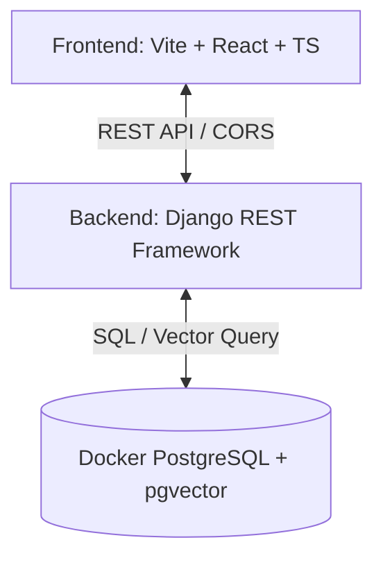

# Kiến trúc Hệ thống QLTT (He_Thong_QLTT)

Tài liệu này mô tả cấu trúc tổng thể và kiến trúc công nghệ của Hệ thống Quản lý Tri thức Học tập (KMS - Knowledge Management System).

## 1. Tổng quan Kiến trúc

Hệ thống được thiết kế theo mô hình **Client-Server** tách biệt hoàn toàn giữa Frontend và Backend, giao tiếp thông qua giao thức HTTP/REST API.

---

## 2. Chi tiết các thành phần Công nghệ

### 2.1. Phía Frontend (`protoc/`)
*   **Công nghệ cốt lõi:** React 18 (TypeScript), Vite 6.
*   **Thư viện UI/UX:**
    *   **shadcn/ui** (dựa trên Radix UI & Tailwind CSS) cho các thành phần UI tinh tế, nhất quán.
    *   **Material UI (MUI)** và **Lucide React** cho hệ thống Icons phong phú.
    *   **Framer Motion / Motion** cho các hiệu ứng chuyển động và micro-animations cao cấp.
*   **Các thư viện tính năng:**
    *   `react-router` cho định tuyến.
    *   `axios` cho việc gọi API tới Backend.
    *   `docx-preview` & `@cyntler/react-doc-viewer` phục vụ việc hiển thị và đọc trực tiếp file giáo án Word/PDF ngay trên web.
    *   `recharts` phục vụ thống kê dữ liệu.
*   **Thiết kế Giao diện đặc trưng:**
    *   **Bố cục Split-Pane Full-Screen (Toàn màn hình chia đôi):** Giao diện chi tiết giáo án (`Lesson Detail`) được thiết kế toàn màn hình dạng chia đôi tỷ lệ 60/40. Cột trái (60%) hiển thị tài liệu đính kèm trực tuyến (PDF Reader / DocxPreview / PowerPoint instructions) và Metadata giáo án. Cột phải (40%) tích hợp khu vực nhận xét, form đánh giá chất lượng (1-5 sao) và bình luận thời gian thực giúp giáo viên phản hồi thuận tiện nhất mà không làm gián đoạn việc xem giáo án.
    *   **Bộ lọc, Phân trang & Sắp xếp Cao cấp (Advanced Filter, Pagination & Sorting):** Hệ thống tích hợp công cụ phân trang (10, 15, hoặc 20 tài liệu/trang) và bộ lọc sắp xếp đa chỉ tiêu (Mới nhất/Cũ nhất, Đánh giá trung bình cao/thấp, Tổng số lượt đánh giá nhiều/ít) thông qua cấu trúc `useMemo` phản hồi tức thì, bảo toàn tốc độ tìm kiếm và đếm số lượng tài liệu thư mục mà không gây trễ truy cập máy chủ.
    *   **Giao diện Thay đổi Thông tin Cá nhân Chuyên nghiệp (UserProfile Modal):** Thiết kế hộp thoại hồ sơ cá nhân hiện đại hỗ trợ thay đổi họ tên và đổi mật khẩu bảo mật (yêu cầu xác thực mật khẩu hiện tại khi thay đổi). Giao diện sử dụng avatar biểu trưng, gradient màu sắc hài hòa và các biểu tượng trực quan.
    *   **Click biểu tượng Logo quay về Tab Thư viện chung:** Biểu tượng 📚 trên Navigation Bar khi được bấm sẽ đồng thời đặt lại `currentView='home'`, xóa bộ lọc thư mục (`selectedDirs=[]`) và chuyển về `homeTab='library'` (Tab Thư viện chung).
    *   **Tách biệt nút Tải tài liệu lên theo từng tab (uploadMode):** Nút "+ Đăng bài giảng" trên Navigation Bar chỉ hiển thị các thư mục công khai (`uploadMode='public'`). Nút "+ Thêm mới" và nút "+ Tải tài liệu lên" (trong Empty State) ở Tab Thư viện cá nhân đã được sửa đổi và tích hợp rành mạch để thiết lập đúng `uploadMode='personal'`, đảm bảo chỉ hiển thị các thư mục cá nhân riêng tư của người dùng hiện tại, ngăn chặn việc hiển thị sai lệch hoặc chọn nhầm các thư mục dùng chung (publish).
    *   **Đồng bộ Layout Card Thư viện:** Card hiển thị tài liệu trong Tab Thư viện cá nhân đã được tái cấu trúc để nhất quán với Tab Thư viện chung: cùng cấu trúc header/badge/description/footer, cùng badge "Xem chi tiết ↗" hover effect, và nút "↓ Tải tài liệu" trong footer. Giữ riêng phần hiển thị phản hồi từ chối chỉ có ở cá nhân.
    *   **Tự động điền Form từ file Word (Auto-fill & Auto-extraction):** Khi người dùng tải tệp giáo án `.docx` lên ở Upload Modal, hệ thống tự động gọi API bóc tách dữ liệu để điền sẵn các trường: Tiêu đề bài giảng, Mô tả/Tóm tắt, Đối tượng học sinh, Loại hình tiết dạy và các Từ khóa kiến thức.

### 2.2. Phía Backend (`backend/`)
*   **Công nghệ cốt lõi:** Django 6.0.5 và Django REST Framework (DRF) 3.17.1.
*   **Tính năng chính:**
    *   Quản lý danh mục thư mục dạng cây đệ quy (`Directory`).
    *   Quản lý bài giảng/giáo án (`LessonPlan`) kế thừa thuộc tính linh hoạt từ thư mục cha.
    *   Bộ phân tích giáo án Word tự động (`docx_parser.py`) sử dụng thư viện `python-docx` để bóc tách thông tin cấu trúc giáo án (tiêu đề, môn học, lớp học, thời gian, đối tượng, tiến trình giảng dạy, từ khóa kiến thức) dưới dạng JSON.
    *   Hệ thống kiểm duyệt giáo án (`ApprovalRequest`) phân quyền đệ quy cho Giáo viên và Admin.
    *   Hệ thống Thư viện cá nhân (Personal Library) quản lý cây thư mục riêng tư và tài liệu cá nhân offline (`status = LOCAL`).
    *   Hệ thống Đề xuất công khai (Propose Public) cho phép người dùng gửi bài giảng cá nhân vào thư mục dùng chung để chờ kiểm duyệt và xuất bản.
    *   Hệ thống Vector hóa tài liệu (`DocumentChunk`) phục vụ tìm kiếm ngữ nghĩa và AI Chat (RAG).
    *   API Cập nhật Hồ sơ cá nhân (`UserProfileUpdateAPIView` tại `/api/users/me/profile/`) thực hiện thay đổi họ tên hiển thị và đổi mật khẩu mã hóa an toàn sau khi đã xác thực mật khẩu cũ.

### 2.3. Cơ sở dữ liệu (`Database`)
*   **Hệ quản trị:** PostgreSQL 16 tích hợp tiện ích mở rộng **pgvector**.
*   **Đặc tính Vector:** Lưu trữ các vector embedding 1536 chiều (`VectorField`) để tìm kiếm ngữ nghĩa tương đồng cho tính năng AI Chatbot.
