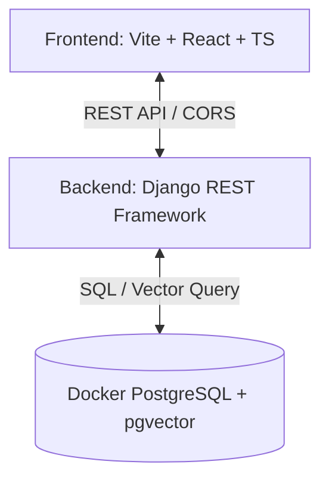

# Kiến trúc Hệ thống QLTT (He_Thong_QLTT)

Tài liệu này mô tả cấu trúc tổng thể và kiến trúc công nghệ của Hệ thống Quản lý Tri thức Học tập (KMS - Knowledge Management System).

## 1. Tổng quan Kiến trúc

Hệ thống được thiết kế theo mô hình **Client-Server** tách biệt hoàn toàn giữa Frontend và Backend, giao tiếp thông qua giao thức HTTP/REST API.

---

## 2. Chi tiết các thành phần Công nghệ

### 2.1. Phía Frontend (`protoc/`)
*   **Công nghệ cốt lõi:** React 18 (TypeScript), Vite 6.
*   **Thư viện UI/UX:**
    *   **shadcn/ui** (dựa trên Radix UI & Tailwind CSS) cho các thành phần UI tinh tế, nhất quán.
    *   **Material UI (MUI)** và **Lucide React** cho hệ thống Icons phong phú.
    *   **Framer Motion / Motion** cho các hiệu ứng chuyển động và micro-animations cao cấp.
*   **Các thư viện tính năng:**
    *   `react-router` cho định tuyến.
    *   `axios` cho việc gọi API tới Backend.
    *   `docx-preview` & `@cyntler/react-doc-viewer` phục vụ việc hiển thị và đọc trực tiếp file giáo án Word/PDF ngay trên web.
    *   `recharts` phục vụ thống kê dữ liệu.

### 2.2. Phía Backend (`backend/`)
*   **Công nghệ cốt lõi:** Django 6.0.5 và Django REST Framework (DRF) 3.17.1.
*   **Tính năng chính:**
    *   Quản lý danh mục thư mục dạng cây đệ quy (`Directory`).
    *   Quản lý bài giảng/giáo án (`LessonPlan`) kế thừa thuộc tính linh hoạt từ thư mục cha.
    *   Hệ thống kiểm duyệt giáo án (`ApprovalRequest`) phân quyền đệ quy cho Giáo viên và Admin.
    *   Hệ thống Thư viện cá nhân (Personal Library) quản lý cây thư mục riêng tư và tài liệu cá nhân offline (`status = LOCAL`).
    *   Hệ thống Đề xuất công khai (Propose Public) cho phép người dùng gửi bài giảng cá nhân vào thư mục dùng chung để chờ kiểm duyệt và xuất bản.
    *   Hệ thống Vector hóa tài liệu (`DocumentChunk`) phục vụ tìm kiếm ngữ nghĩa và AI Chat (RAG).

### 2.3. Cơ sở dữ liệu (`Database`)
*   **Hệ quản trị:** PostgreSQL 16 tích hợp tiện ích mở rộng **pgvector**.
*   **Đặc tính Vector:** Lưu trữ các vector embedding 1536 chiều (`VectorField`) để tìm kiếm ngữ nghĩa tương đồng cho tính năng AI Chatbot.
